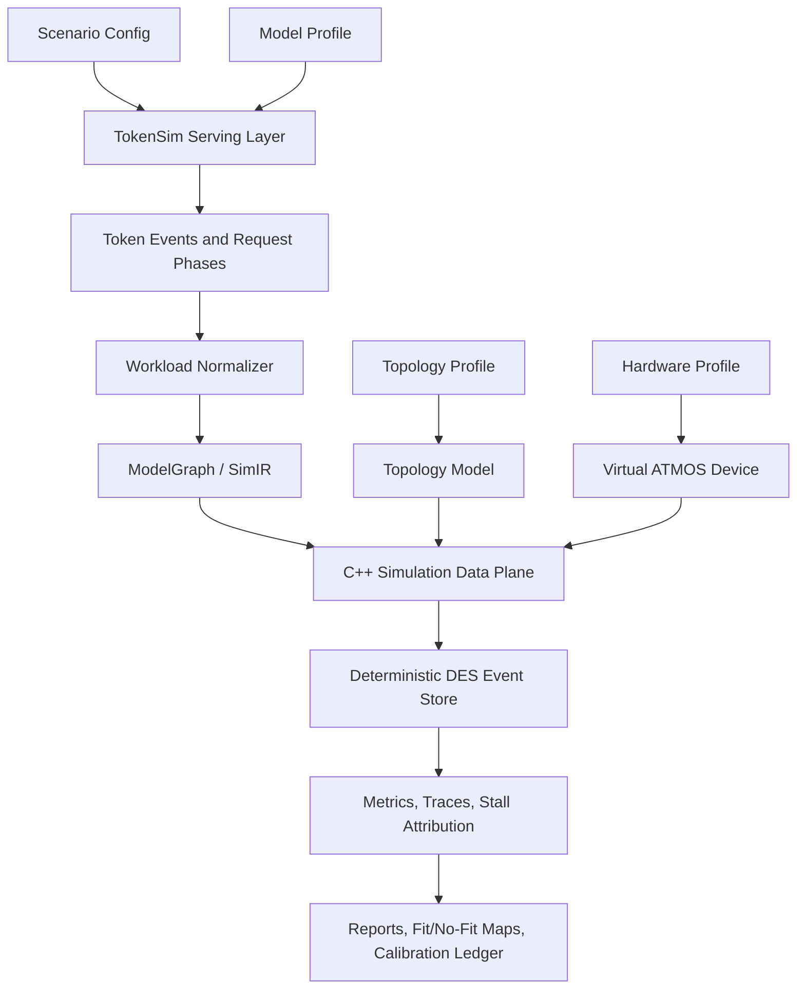
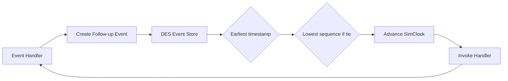
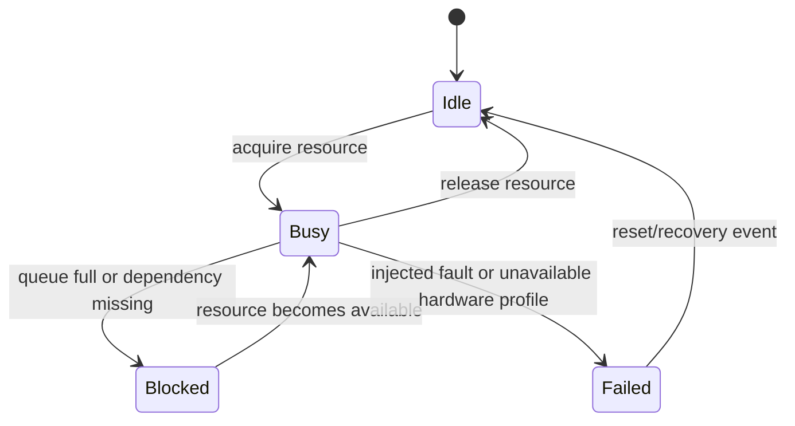
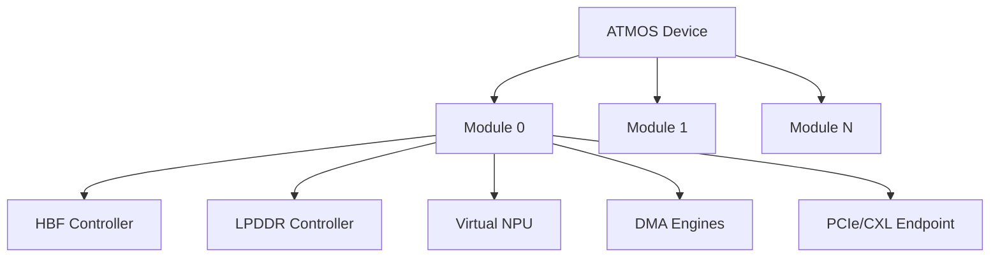
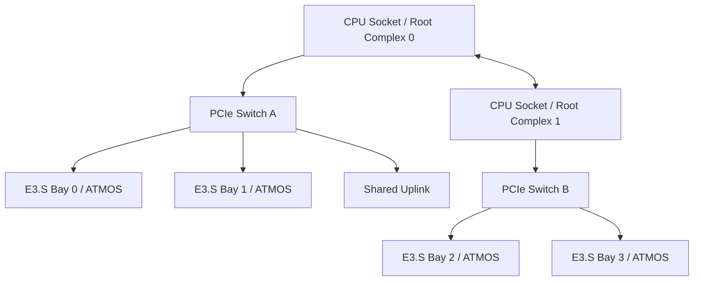
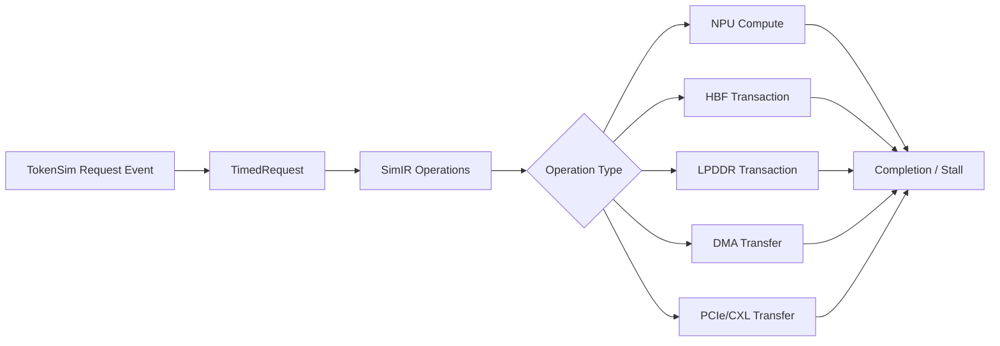
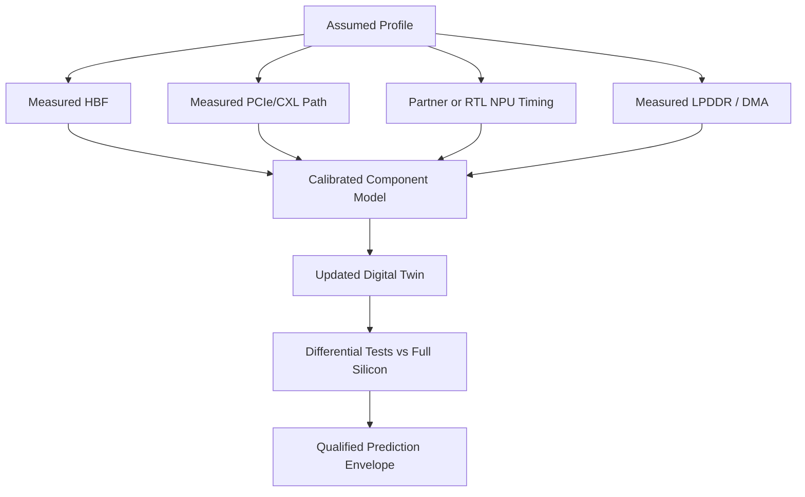
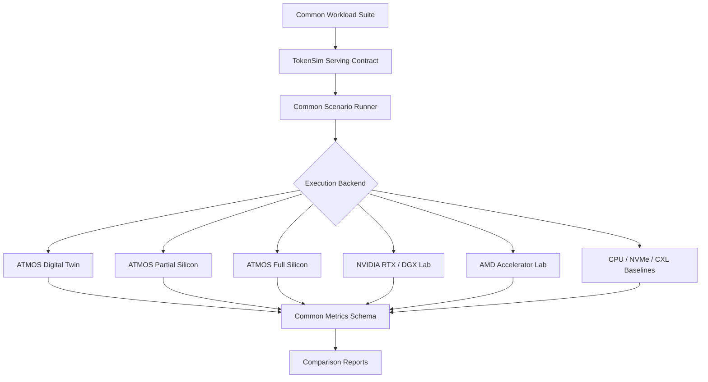
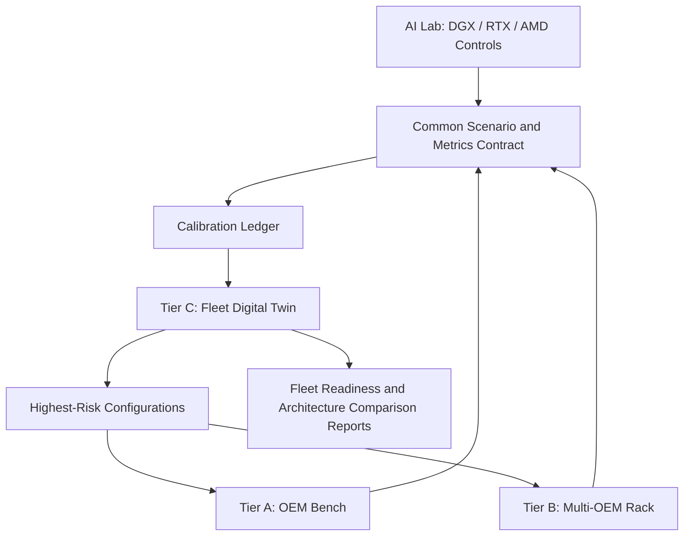
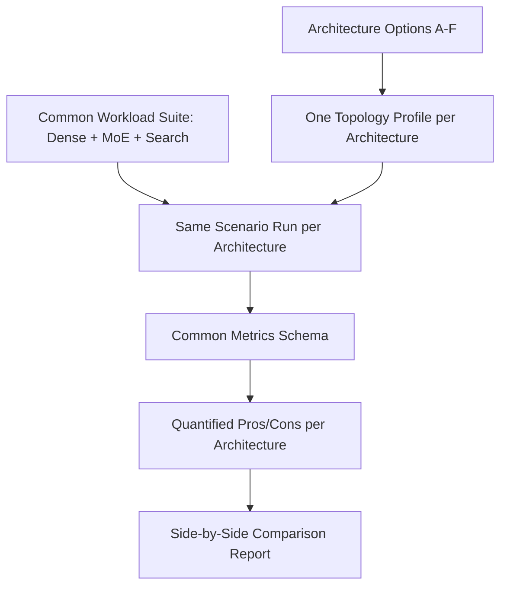

# ATMOS Digital Twin Emulator — System Proposal

**Project:** ATMOS Digital Twin Emulator
**Date:** 2026-09-17
**Audience:** Executive management, product, architecture, silicon, firmware, platform software, OEM engineering, performance, and POC teams
**Decision requested:** Approve a focused emulator workstream that can guide ATMOS product choices before complete silicon exists, remain useful as partial hardware arrives, and become the regression and calibration harness for real devices.

---

## 1. Overview

ATMOS decisions are being made right now — form factor, HBF capacity, LPDDR sizing, NPU balance, PCIe/CXL lane width, and OEM topology — without a system-level way to test any of them. Every one of these decisions gets harder and more expensive to change the later it is caught. A memory-tier size chosen in a spreadsheet today becomes a BOM commitment in a quarter and a fixed silicon constraint after tape-out. This proposal exists to move that evidence earlier, while it is still cheap to be wrong.

### 1.1 The Scale We Are Actually Building For

Sandisk's target deployment is not one device on one bench. It is hundreds of E3.S devices, attached either through OEM chassis bays or as ATMOS PCIe add-in cards, spread across multiple OEM server families, each running a different mix of dense and MoE models for different tenants. No single physical device, no static spreadsheet, and no vendor RTL testbench can predict how that fleet behaves. Only a system-level, swappable-backend simulator can, and it needs to exist before we commit to the hardware that fleet will run on.

### 1.2 Significance

| Reason                                                                                               | What happens without it                                                                                                                            |
| ---------------------------------------------------------------------------------------------------- | -------------------------------------------------------------------------------------------------------------------------------------------------- |
| Silicon and OEM platforms arrive in pieces (HBF, NPU, PCIe/CXL, full silicon) on different schedules | Product and architecture decisions stall waiting for the last piece, or get made blind on the pieces that have not arrived yet                     |
| Hundreds of E3.S devices across multiple OEMs is the target, not one bench unit                      | We discover fleet-scale bottlenecks (shared uplinks, control-plane limits, weight-distribution stalls) only after hardware is racked and committed |
| Dense and MoE workloads stress HBF, LPDDR, NPU, and topology very differently                        | We size memory and compute for the wrong workload mix and find out during OEM qualification, not before it                                         |
| NVIDIA and AMD accelerators are already being measured in the AI lab today                           | ATMOS is compared against competitors using anecdote and marketing slides instead of matched, evidence-based reports                               |
| Physical POC iteration is slow, expensive, and hardware-constrained                                  | Every architecture question costs a lab cycle instead of a simulation run, and only a handful of configurations ever get tested                    |
| Assumptions used for sizing decisions are rarely labeled by confidence                               | Executives cannot tell the difference between a guess and a measured result when approving a design                                                |

### 1.3 Benefits

- A single workload and reporting contract that works before silicon, during partial bring-up, after full silicon, and at fleet scale in production — the investment is not thrown away at each hardware milestone.
- The ability to test hundreds-of-device, multi-OEM, mixed dense/MoE fleet scenarios in software, long before that many physical devices could ever be racked.
- Evidence-labeled results, so a management decision can distinguish an assumed range from a measured, partner-modeled, or silicon-calibrated number.
- A direct, apples-to-apples comparison against NVIDIA RTX/DGX and AMD systems already in the AI lab, using the same traces and the same report format.
- A pre-silicon way to catch an under-sized memory tier, an oversubscribed PCIe topology, or a starved NPU before it becomes a fixed cost in silicon or a failed OEM qualification.

This is not a research nice-to-have. It is the only practical way to make hundreds-of-device, multi-OEM ATMOS decisions with evidence instead of guesswork, on the timeline the business actually has.

---

## 2. Executive Summary

ATMOS needs a practical digital twin: a deterministic software emulator that models how token-serving workloads consume NPU compute, HBF model capacity, LPDDR working memory, DMA engines, PCIe/CXL links, and OEM server topology. The emulator should be useful before silicon, during bring-up, and after silicon by replacing assumptions with measured component behavior as hardware becomes available.

The proposed system starts from **TokenSim as an integral serving layer**. TokenSim provides realistic request arrivals, batching behavior, token phases, prefill/decode scheduling, KV pressure, and serving-policy traces. Those token-serving events feed a C++ discrete-event simulation data plane that models the ATMOS hardware resources underneath.

The central principle is simple: the emulator does not hard-code a result such as "this request takes 4.3 ms." It simulates which resources each request needs, when each resource is available, how long each operation occupies that resource, and what blocks dependent work. Latency, throughput, queue depth, utilization, and bottlenecks emerge from resource occupancy, topology, dependencies, arbitration, and contention.

The first value is not a customer-facing performance claim. The first value is a decision engine:

- Which use cases are realistic for ATMOS E3.S?
- What HBF capacity and bandwidth are required for Search, neural reranking, and MoE serving?
- When does LPDDR working memory, DMA, NPU compute, or PCIe topology become the limiter?
- What measurements are needed first when partial silicon arrives?
- How should hardware, firmware, runtime, and OEM teams prioritize bring-up evidence?

---

## 3. Product Problem

ATMOS is expected to combine persistent model capacity, local neural compute, active memory, and a host interface in a modular inference device. Before complete silicon exists, product and engineering teams still need to make decisions about form factor, memory size, NPU capability, firmware queues, host interface, OEM topology, and workload fit.

The emulator answers questions that cannot be answered by static spreadsheets alone:

- How many requests can a device sustain before the service misses TTFT, TPOT, or p99 goals?
- Which phase dominates: prefill, decode, expert dispatch, KV movement, HBF read, LPDDR access, DMA, or PCIe?
- Does a model fit in HBF, and how much of that model is actually touched during serving?
- Does HBF provide value for expert residency, long-context KV, Search indexes, or neural reranking weights?
- What happens if HBF hardware is ready before the NPU, or if an NPU model is ready before final HBF media?
- Which measurements should be captured from partial hardware to reduce prediction uncertainty?

The emulator should be explicit about confidence. A result based on assumed bandwidth ranges is different from a result calibrated against measured HBF, measured PCIe, partner NPU timing, or final silicon.

---

## 4. Architecture Overview

The emulator has two cooperating layers — **TokenSim** as the serving/scheduling intelligence, and the **C++ discrete-event data plane** as the hardware simulation underneath. TokenSim is not a side integration; it is the default way to represent token-serving behavior.

```
                              ATMOS Digital Twin
                                       |
                    ┌──────────────────┴──────────────────┐
                    │                                      │
            Rust Control /                       C++ Simulation
            Scenario Plane                          Data Plane
                    │                                      │
        ┌───────────┼───────────┐              ┌──────────┼──────────┐
        │           │           │              │          │          │
   Scenario     TokenSim    Topology       DES Core   Virtual    OEM
   Config      Serving      Profile       Event      ATMOS     Topology
               Layer                    Engine       Device     Model
        │           │           │              │          │          │
        │     ┌─────┴─────┐     │         ┌────┴────┐  ┌──┴──┐  ┌───┴───┐
        │     │           │     │         │         │  │     │  │       │
        │  Batch      KV Cache  │      Event    Resource NPU  HBF   PCIe
        │  Sched.     Manager   │      Queue    Pools   /LPDDR Switches
        │     │           │     │         │         │  │ DMA │  │  RC   │
        │  Token       Latency  │      SimClock  Dependency Endpoint
        │  State       Model    │                   Tracker
        │     │           │     │
        │     └─────┬─────┘     │
        │           │           │
        └───────────┼───────────┘
                    │
         Workload Normalizer
         (TokenSim → TimedRequest)
                    │
            ModelGraph / SimIR
                    │
         ┌──────────┼──────────┐
         │          │          │
     Transformer  MoE       Search /
     Compiler    Compiler    Reranking
         │          │          │
         └──────────┼──────────┘
                    │
              Metrics + Traces
              Stall Attribution
              Calibration Ledger
                    │
         ┌──────────┼──────────┐
         │          │          │
     Fit/No-Fit   Sensitivity  Side-by-Side
     Reports      Analysis     vs RTX/DGX
```

### How Data Flows

1. **Scenario config** defines the experiment: model, workload, hardware profile, topology, scheduling policy, calibration sources.
2. **TokenSim** consumes the config and produces realistic token-level events — request arrivals, batching decisions, prefill/decode phase markers, KV pressure signals, and completion traces.
3. **Workload normalizer** converts TokenSim events into deterministic `TimedRequest` streams and phase markers for the C++ data plane.
4. **ModelGraph compiler** (Transformer, MoE, Search/Reranking) compiles model profiles into SimIR operation DAGs with dependency edges.
5. **C++ DES engine** processes events in deterministic virtual time — acquiring resources, scheduling completions, recording stalls, and tracking utilization.
6. **Virtual ATMOS device** models NPU compute, HBF/LPDDR memory, DMA engines, and PCIe endpoints as finite-capacity resources.
7. **Topology model** models root complexes, switches, E3.S bays, shared uplinks, and peer-to-peer paths.
8. **Metrics and stall attribution** explain what happened: TTFT, TPOT, throughput, utilization, queue depth, bytes moved, and stall-reason breakdown.
9. **Calibration ledger** tracks parameter confidence as assumptions are replaced with measured hardware data.

### Programming Languages

| Layer                            | Language | Responsibility                                                                                                                                |
| -------------------------------- | -------- | --------------------------------------------------------------------------------------------------------------------------------------------- |
| **Scenario orchestration** | Rust     | Configuration, REST/gRPC API, experiment management, workload ingestion, topology ingestion, result database, visualization, parameter sweeps |
| **TokenSim serving layer** | C++17    | Batching, scheduling policies, KV cache management, token state machines, TTFT/TPOT metrics                                                   |
| **Simulation engine**      | C++17    | Deterministic discrete-event engine, virtual hardware, queues, resource arbitration, model execution, memory transactions, DMA, PCIe topology |

## 5. Proposed System

The system has two cooperating planes:

- **Scenario and serving plane:** owns workload definitions, TokenSim execution or trace import, model profiles, topology profiles, experiment sweeps, manifests, and results.
- **C++ simulation data plane:** owns deterministic virtual time, event ordering, hardware resource state, queues, memory transactions, DMA movement, PCIe traversal, dependency resolution, metrics, and stall attribution.



TokenSim is not a side integration. It is the default way to represent token-serving behavior. Native synthetic workload generation remains useful for small tests, analytical bounds, and debugging, but the proposal treats TokenSim traces as the main workload contract for realistic serving experiments.

---

## 6. Component Roles

| Component                  | Role                                             | How it works under the hood                                                                                                                                                                                       |
| -------------------------- | ------------------------------------------------ | ----------------------------------------------------------------------------------------------------------------------------------------------------------------------------------------------------------------- |
| Scenario config            | Defines what experiment is being run             | Versioned YAML/JSON captures model, workload, hardware profile, topology, placement policy, seed, fidelity level, and calibration sources.                                                                        |
| TokenSim serving layer     | Produces realistic token-serving pressure        | Simulates or replays request arrivals, batching, queueing, prefill/decode boundaries, token generation cadence, priorities, cancellations, and KV pressure.                                                       |
| Workload normalizer        | Converts serving events into simulator inputs    | Converts TokenSim events into deterministic `TimedRequest` streams and phase markers, preserving request id, timestamp, prompt length, output limit, model id, priority, and trace lineage.                     |
| ModelGraph / SimIR         | Represents model execution as a dependency graph | Compiles model profiles into operations such as RMSNorm, QKV projection, attention, KV read/write, MLP, residual, expert dispatch, expert compute, combine, embedding, pooling, and reranking score.              |
| C++ simulation data plane  | Runs fast deterministic hardware simulation      | Uses integer nanosecond virtual time, a priority event store, dependency tracking, finite resources, and event handlers that acquire resources, calculate service times, schedule completions, and record stalls. |
| Virtual ATMOS device       | Models device-local hardware resources           | Represents NPU queues, tensor/vector engines, local SRAM, HBF channels, LPDDR channels, DMA descriptors, PCIe endpoint state, and per-module capacity limits.                                                     |
| Topology model             | Models server and OEM interconnect effects       | Represents root complexes, PCIe switches, E3.S bays, shared uplinks, peer-to-peer paths, link width, generation, queue depth, latency, and arbitration.                                                           |
| Metrics and trace recorder | Explains what happened                           | Records request latency, TTFT, TPOT, throughput, utilization, queue depth, bytes moved, phase time, stall reasons, and timestamped event traces.                                                                  |
| Calibration ledger         | Tracks evidence quality                          | Stores parameter source, owner, date, confidence class, measured range, allowed use, and replacement history as assumptions become measured values.                                                               |

---

## 7. C++ Simulation Data Plane

The C++ data plane is responsible for speed, determinism, and hardware-like resource accounting. It does not generate semantic model outputs. It answers: given this workload and this hardware profile, when can each operation run, what does it wait for, and which resources limit throughput?

### 7.1 Data Plane Inputs

The data plane consumes normalized simulation inputs:

- TokenSim request stream: arrival time, request id, priority, prompt tokens, target output tokens, model id.
- TokenSim phase stream: prefill start/end, decode-token ready, batching decision, queue admission, cancellation, completion.
- Model profile: layers, hidden size, attention heads, KV heads, expert count, active experts, embedding dimensions, precision, operator coverage.
- Hardware profile: NPU peak throughput, engine counts, SRAM size, HBF capacity/bandwidth/channels, LPDDR capacity/bandwidth/channels, DMA bandwidth, queue depths, outstanding limits.
- Topology profile: PCIe/CXL generation, lane count, switches, root complexes, shared uplinks, peer path rules, host memory path, NUMA placement.

### 7.2 DES Event Store

The DES event store is a deterministic priority queue. Each event has:

- `timestamp`: virtual simulation time in integer nanoseconds.
- `sequence`: monotonic tie-breaker for events with the same timestamp.
- `type`: request, memory, DMA, PCIe, compute, dependency, scheduler, or custom event.
- `target`: resource or entity being acted on.
- `payload`: compact metadata such as bytes, operation id, source, destination, or request id.



### 7.3 Event Processing Loop

At runtime, the data plane repeatedly performs this loop:

1. Pop the earliest event from the DES event store.
2. Advance the virtual clock to that event's timestamp.
3. Update resource busy/idle accounting up to the new time.
4. Dispatch the event to registered C++ handlers.
5. The handler checks dependencies and resource availability.
6. If resources are available, acquire them and schedule a completion event.
7. If resources are unavailable, enqueue, block, retry, or record a stall.
8. On completion, release resources and mark dependent operations ready.
9. Continue until the event store is empty or the experiment time limit is reached.

```text
REQUEST_ARRIVED
  -> SCHEDULER_DISPATCHED
  -> MEMORY_READ_STARTED
  -> MEMORY_READ_COMPLETED
  -> DMA_STARTED
  -> DMA_COMPLETED
  -> COMPUTE_STARTED
  -> COMPUTE_COMPLETED
  -> DEPENDENCY_SATISFIED
  -> REQUEST_COMPLETED
```

### 7.4 Resource Model

Every hardware block is modeled as a finite resource. A resource has capacity, occupancy, state, queue depth, service time, and utilization tracking.



This is the key modeling choice: the simulator does not pretend to be real silicon instruction-by-instruction. It models the resource constraints that determine system behavior.

---

## 8. Virtual ATMOS Hardware Model

ATMOS is modeled as one or more modules. Each module contains persistent HBF capacity, active LPDDR memory, NPU compute, local SRAM, DMA engines, and a host endpoint.



### 8.1 Virtual NPU

The Virtual NPU models neural compute as finite execution capacity:

- Command queue controls how many operations can be admitted.
- Tensor engines execute GEMM, attention, and expert matrix work.
- Vector engines execute elementwise, normalization, activation, pooling, and reduction work.
- Load/store engines model data movement between local SRAM and memory-facing resources.
- Local SRAM capacity controls whether tiles, activations, and command metadata fit.
- Execution slots control concurrent in-flight compute operations.

For each compute operation, the simulator calculates an estimated service time from FLOPs, compute class, precision, configured peak throughput, and future calibration factors. The operation cannot start until dependencies are satisfied and required NPU resources are available. If tensor engines are full, the operation waits in `WAIT_COMPUTE`. If SRAM is insufficient, it waits in `WAIT_SRAM` or triggers a tiling/spill path depending on the fidelity level.

### 8.2 HBF Controller

The HBF controller models persistent model capacity and high-bandwidth read-mostly access:

- Capacity tracks resident weights, experts, embeddings, tables, Search indexes, and model packs.
- Channels model parallel media/controller access.
- Request queues model backpressure when too many reads or writes arrive.
- Outstanding limits bound concurrency inside the controller.
- Bandwidth and protocol overhead determine transfer service time.
- Arbitration decides which channel or requester is served next.

HBF is where the emulator tests whether capacity-side benefits survive real access behavior. A model may fit in HBF but still bottleneck on channel pressure, controller queues, or DMA into active memory.

### 8.3 LPDDR Controller

LPDDR models active writable memory:

- KV cache state.
- Activations and temporary tensors.
- Expert working tiles.
- Search/reranking intermediate buffers.
- Command rings and software-visible queues.

LPDDR differs from HBF because it is smaller, more active, and sensitive to read/write direction changes and refresh overhead. Decode-heavy workloads can stress LPDDR even when HBF capacity is sufficient.

### 8.4 DMA Engines

DMA engines model movement between memory tiers and endpoints:

- HBF to LPDDR.
- LPDDR to local SRAM.
- Host memory to device.
- Device to host.
- Device to device through PCIe/CXL topology when supported.

Each transfer consumes descriptor queue entries, outstanding slots, channels, setup overhead, and bandwidth. This lets the emulator expose cases where compute is available but data movement cannot feed it fast enough.

### 8.5 PCIe/CXL Endpoint and OEM Topology

The endpoint and topology model represent the server around the device:

- E3.S bay mapping.
- Link generation and lane width.
- Switches and root complexes.
- Shared uplinks and oversubscription.
- Peer-to-peer path availability.
- Host-memory staging and NUMA penalties.
- Management and reset path assumptions.



This is essential because a device-level result is not enough. A workload can look healthy on one device and fail when multiple devices share an uplink, cross root complexes, or stage through host memory.

---

## 9. TokenSim as the Serving Contract

TokenSim is part of the base architecture because ATMOS value depends on serving dynamics, not just isolated operator timing. Search and MoE workloads both create time-varying request pressure, batch composition, memory reuse, and queueing behavior.

TokenSim should provide or replay:

- Request arrival patterns: fixed, Poisson, burst, trace-driven, priority classes.
- Batching decisions: batch creation, admission, split prefill, chunked prefill, decode batching.
- Phase markers: queued, prefill, decode, paused, resumed, completed, cancelled.
- KV behavior: allocation, reuse, eviction, restore, recompute, migration hints.
- MoE behavior: token-to-expert routing, active expert set, dispatch/combine phases, hot expert reuse.
- Search behavior: query arrival, embedding, candidate fetch, reranking batch, result assembly.

The C++ data plane then maps those serving events to hardware actions:



This split keeps the serving model honest and the hardware model explainable. TokenSim decides what the service is trying to do; the ATMOS digital twin decides when the hardware can actually do it.

---

## 10. Partial Silicon and Bring-Up Strategy

The emulator should become more valuable as hardware arrives in pieces. It must support replacing individual assumptions with measured components without waiting for the full device.



### 10.1 If HBF Arrives Before NPU

The emulator can use measured HBF bandwidth, latency, queue depth, access granularity, endurance constraints, and controller behavior while keeping NPU timing analytical or partner-modeled. This supports early decisions about:

- Model and expert residency.
- Search index and embedding-table placement.
- Sustained read behavior under concurrent requests.
- DMA staging requirements from HBF into active memory.
- Whether HBF bandwidth or access granularity is sufficient for the target workloads.

### 10.2 If NPU Timing Arrives Before HBF

The emulator can consume measured or partner-modeled NPU operator timing while HBF remains an assumed or synthetic tier. This supports early decisions about:

- Operator coverage and unsupported fallback paths.
- Tensor/vector engine balance.
- SRAM tile sizes.
- Compute efficiency by operator class.
- Whether compute is likely to outrun memory movement.

### 10.3 If PCIe/OEM Platform Arrives First

The emulator can use measured host topology, link bandwidth, peer-to-peer behavior, NUMA effects, and shared-uplink contention while keeping device internals virtual. This supports early decisions about:

- E3.S bay placement.
- x4 versus x8 requirements.
- Root-complex crossing cost.
- Host staging cost.
- Multi-device scaling limits.

### 10.4 After Full Silicon

When full silicon is available, the emulator becomes a regression and planning harness:

- Replay the same TokenSim traces against the emulator and real hardware.
- Compare predicted and measured TTFT, TPOT, throughput, queue depth, bytes moved, and utilization.
- Replace broad assumptions with calibrated distributions.
- Track prediction error by workload, topology, model, and firmware version.
- Use the calibrated twin for design-space exploration beyond the exact hardware tested.

---

## 11. Current Priority Use Cases

The initial use cases should be narrow enough to produce credible evidence and broad enough to guide product direction.

### 11.1 Search, Embedding, and Neural Reranking

The Search track is based on the ATMOS E3.S product/workstream framing: independent neural services and medium-size model serving in a modular E3-class device.

Primary workloads:

- Embedding generation for query and document chunks.
- Neural reranking over candidate query-document pairs.
- Guard/classification models around retrieval and response flows.
- RAG preprocessing pools where embedding, reranking, and guard stages are isolated from the main LLM engine.
- Private domain models where one model or service fits on one device.

What the emulator measures:

- Embeddings per second, pairs per second, request p50/p95/p99.
- Batch-size sensitivity and queueing behavior.
- HBF residency of embedding/reranking weights and tables.
- LPDDR workspace pressure for candidate batches and intermediate tensors.
- Host ingress/egress bytes and PCIe/CXL path cost.
- Device-pool scaling: one model per device, replicated pools, tenant/domain isolation.

Why ATMOS may fit:

- Search services are often independently scalable and highly batchable.
- Neural reranking uses transformer scoring over candidate batches and can benefit from dedicated devices.
- Persistent local model capacity can reduce cold-load and model-switch costs.
- A modular E3.S deployment model can map naturally to per-service or per-tenant inference pools.

### 11.2 MoE Serving and HBF Evaluation

The MoE track is based on the HBF/OEM/LLM evaluation framing: high-concurrency serving with varied context sizes, expert placement, KV reuse, and topology sensitivity.

Primary workloads:

- Small resident control model to validate the serving harness.
- Resident MoE where experts fit in fast local memory.
- Tiered MoE where hot experts or larger expert sets use HBF as a lower persistent tier.
- Long-context decode to isolate KV capacity and attention cost.
- Reusable prefix and paused-session scenarios to compare retain, restore, and recompute.
- Mixed arrivals and contention with short/long requests, bursts, priorities, and interference.

What the emulator measures:

- Sustainable requests per second under fixed latency and correctness requirements.
- TTFT, TPOT, output tokens per second, and input-token processing separately.
- Expert dispatch/combine cost versus actual expert weight movement.
- HBF bytes fetched, hot-expert hit behavior, prefetch effectiveness, and NPU starvation.
- KV footprint, active/shared KV, activations, workspaces, communication buffers, and I/O rings.
- Topology impact across tensor parallelism, expert parallelism, replicas, and multi-device layouts.

Important modeling rule:

Changing which expert a token selects is not the same as reloading expert weights. The emulator must separate dispatch/combine traffic to resident expert owners from additional weight-residency changes. Otherwise HBF value can be overstated or understated.

## 12. Success Criteria

### MVP Outputs

- TokenSim-driven workload replay into the ATMOS C++ data plane.
- One-device and multi-device topology experiments.
- Search/reranking workload profile and MoE serving workload profile.
- HBF versus LPDDR placement experiments.
- Stall attribution across scheduler, dependency, HBF, LPDDR, DMA, PCIe/CXL, and compute.
- Fit/no-fit report with evidence labels and parameter sensitivity.
- Which workloads justify ATMOS E3.S first.
- Whether HBF capacity, bandwidth, and access granularity are sufficient.
- Whether NPU compute, memory movement, or topology is the gating factor.
- Which hardware blocks need measurement next.
- Which configurations should advance to physical POC.
- Versioned model, workload, hardware, and topology profiles.
- Repeatable traces with seeds, trace hashes, build version, and calibration metadata.
- Calibration ledger that tracks assumed, measured, partner-modeled, RTL/FPGA-calibrated, and silicon-measured parameters.
- Differential reports when partial or full hardware is available.
- OEM compatibility matrix for slots, bays, power, cooling, firmware, reset, and management paths.

---

## 13. Fidelity and Evidence Classification

Every result must identify both its simulation fidelity and its evidence source. This prevents an analytical estimate, a calibrated component result, and a full-silicon measurement from appearing equivalent in an executive comparison.

| Class | Basis | Permitted use |
|---|---|---|
| Assumed | Engineering range without measurement | Sensitivity and fit/no-fit exploration only |
| Architecture target | Approved internal design target | Requirement analysis and design gating |
| Measured control | AI Lab, OEM platform, PCIe, NVMe/GDS, CXL, or component measurement | Baseline comparison and calibration |
| Partner modeled | Versioned partner model, RTL, FPGA, or emulator result | Pre-silicon projection with source labeling |
| Partial silicon | Measured HBF, NPU, LPDDR, DMA, or PCIe component integrated into the twin | Component-calibrated system prediction |
| Full silicon | Qualified ATMOS hardware and software stack | Validation and claims within the tested envelope |

Reports must include the scenario version, workload trace hash, backend version, parameter sources, and confidence class for every comparison row.

---

## 14. Target Platform

Development should start on macOS and Linux because the emulator is CPU-bound and does not require CUDA. Large sweeps and CI should run on Linux.

Required software:

- C++17 compiler.
- CMake 3.20 or newer.
- GoogleTest for unit tests, fetched by CMake.
- Rust only if the scenario/API plane is implemented in Rust.
- Python only if TokenSim execution, trace generation, or analysis notebooks require it.

No GPU is required for the emulator itself. GPU systems remain useful as measured controls for comparison against existing RTX/NVMe/GDS and RTX/CXL paths.

---

## 15. Lab Setup and End-to-End Evaluation Framework

The lab combines physical systems with the fleet-scale digital twin. Its purpose is not simply to host hardware; it provides one controlled environment where the same workload, trace, topology description, and reporting flow run against simulated ATMOS, partial or complete ATMOS hardware, and measured competitor baselines.

- ATMOS digital twin without silicon.
- ATMOS partial-silicon profiles, such as measured HBF with simulated NPU timing.
- Full ATMOS silicon when available.
- NVIDIA RTX or DGX systems in the AI lab.
- AMD accelerator systems when available.
- CPU, NVMe/GDS, CXL, or host-memory staging baselines.

The framework enables apples-to-apples comparison by keeping the workload contract stable while swapping the execution backend.



### 15.1 Swappable Backend Contract

Each backend should implement the same logical contract:

- `describe_device`: reports memory tiers, compute capability, topology, precision support, queue limits, and software stack version.
- `load_model`: stages or registers model weights, experts, embedding tables, indexes, and runtime metadata.
- `run_trace`: consumes the TokenSim request/phase trace or a normalized workload trace.
- `report_metrics`: returns request metrics, token metrics, resource utilization, bytes moved, queue depth, errors, and stall categories.
- `evidence`: labels whether results are simulated, measured, partially measured, partner-modeled, or silicon-measured.

This lets the same Search or MoE workload run in several modes:

| Mode                 | Backend                         | Purpose                                                                                    |
| -------------------- | ------------------------------- | ------------------------------------------------------------------------------------------ |
| Pre-silicon          | ATMOS digital twin              | Estimate fit, bottlenecks, and design sensitivity before hardware.                         |
| Partial hardware     | ATMOS component-calibrated twin | Replace assumptions with measured HBF, NPU, DMA, LPDDR, or PCIe behavior as pieces arrive. |
| Full hardware        | ATMOS silicon                   | Validate predictions, calibrate the model, and qualify the tested envelope.                |
| Competitive baseline | NVIDIA RTX / DGX                | Compare against known GPU paths in the AI lab under the same traces and reports.           |
| Competitive baseline | AMD accelerator                 | Compare against alternative accelerator architecture when available.                       |
| System baseline      | CPU / NVMe / CXL                | Separate storage, memory, and host-staging effects from accelerator effects.               |

### 15.2 AI Lab and DGX Integration

The existing AI Lab becomes the measured-control plane for the program. Its DGX server supplies a stable, repeatable NVIDIA baseline while ATMOS remains simulated or partially available. RTX systems provide lower-scale and workstation-class controls; AMD systems are added through the same backend contract when available.

The DGX server is used in four practical ways:

1. **Reference serving baseline:** run the same dense, MoE, embedding, and reranking models with the same TokenSim arrival traces, prompt/output limits, precision, batching policy, and SLOs used by the ATMOS twin.
2. **Calibration source:** measure operator throughput, end-to-end TTFT/TPOT, host-device movement, storage staging, and topology behavior to validate the workload harness and bound assumptions before ATMOS silicon exists.
3. **Scale-pattern control:** exercise tensor parallelism, expert parallelism, replicas, KV reuse, and multi-GPU contention on a known platform, then compare where ATMOS predicts different behavior because of HBF persistence or E3.S topology.
4. **Regression anchor:** rerun a frozen DGX scenario set whenever the workload generator, TokenSim integration, metrics schema, or report pipeline changes, proving that framework changes did not silently alter the comparison.

The lab integration should capture:

- GPU model, count, driver, runtime, serving engine, precision, and framework version.
- Host CPU, memory, NUMA, PCIe topology, NVMe/GDS path, CXL path, and network topology.
- Model load time, warm state, batch policy, prompt/output settings, and tokenizer/version.
- TTFT, TPOT, p50/p95/p99, output tokens per second, input-token processing rate, request throughput, and error rate.
- GPU utilization, memory utilization, host-device bytes, storage bytes, cache behavior, and queue depth where available.

DGX runs should additionally capture GPU-to-GPU topology, NVLink/NVSwitch traffic, collective time, per-GPU memory occupancy, power, thermals, and node-level energy. These are reported as NVIDIA-specific evidence fields rather than forced into ATMOS resource names.

The comparison should not claim that simulated ATMOS results are measured hardware results. Reports must label every result by evidence class. The value is that all systems are evaluated through one workload harness, one metrics schema, and one report format.

### 15.3 Why This Matters

This framing turns the workstream into a reusable product and architecture evaluation platform:

- Before silicon, it answers whether ATMOS should be pursued for a workload and what must be true for success.
- During partial silicon, it directs which measured component should replace which assumption.
- With full silicon, it becomes the regression harness and prediction-calibration tool.
- With AI lab systems, it compares ATMOS against NVIDIA and AMD alternatives using the same use-case definitions.
- For executives, it produces workload-fit maps and investment gates.
- For engineering, it produces bottleneck attribution, sensitivity ranking, and measurement priorities.

### 15.4 Deployment Scale and Lab Principle

The target is hundreds of E3.S devices across multiple OEM server families, attached through direct bays, switched bays, or ATMOS PCIe cards, and running mixed dense, MoE, Search, and reranking workloads. No practical pre-silicon lab can physically cover that matrix. The lab therefore combines representative physical systems with a calibrated fleet-scale digital twin.



### 15.5 Physical and Simulated Lab Tiers

| Tier | Composition | Scale | Purpose |
|---|---|---|---|
| AI Lab control plane | DGX server, available RTX systems, future AMD systems, NVMe/GDS and CXL fixtures where available | Existing measured systems | Establish competitive baselines and continuously validate the common workload and reporting harness |
| Tier A — OEM bench | One reference OEM server with prototype or production E3.S devices, full-length ATMOS card, direct-attached bays, and separate switch-AIC fixtures as available | 1-8 ATMOS devices per OEM | Measure per-bay links, NUMA, DMA, P2P, shared uplinks, power/thermal behavior, and single-node serving |
| Tier B — multi-OEM rack | At least two OEM server families connected through a representative top-of-rack network | 8-32 physical devices across 2-3 OEMs | Validate hybrid nodes, cross-node behavior, model distribution, failures, recovery, and mixed dense/MoE operation |
| Tier C — fleet digital twin | Software instances of every qualified OEM and architecture topology | Hundreds to thousands of simulated devices | Sweep fleet size, OEM mix, architecture pattern, model mix, tenancy, and faults beyond physical lab capacity |

Architecture D (OEM-integrated switched E3.S) enters Tier A when an OEM engineering sample exists. Until then, its proposed lane map and population rules remain an explicitly assumed Tier C profile.

### 15.6 OEM Topology Profile Registry

Each OEM platform is captured once as a versioned topology profile shared by the physical runner and simulator:

- Bay and slot population rules, including E3.S and full-length card combinations.
- PCIe/CXL generation, lane width, root-complex locality, switch hierarchy, and retimers.
- Shared-uplink oversubscription, P2P availability, host staging, and NUMA behavior.
- Power and thermal limits per bay, card, and server.
- Firmware, BMC, reset, health, and service assumptions.
- Evidence source and date for every parameter.

This registry converts an OEM bench measurement into a reusable fleet-scale model rather than a one-time lab result.

### 15.7 Architecture Fixtures

The reference lab should support the architecture options defined in Section 16:

- A full-length ATMOS card in a qualified accelerator slot.
- Direct-attached E3.S bays with no shared switch in the device path.
- E3.S bays connected through a separate PCIe switch AIC.
- An OEM-integrated switched sample when a partner platform becomes available.
- A hybrid node combining full-card and E3.S resource classes.
- A multi-node rack fixture with representative NICs and top-of-rack switching.

The same frozen workload trace should run on each available fixture and its matching simulated topology profile.

### 15.8 Fleet Test Matrix

| Dimension | Example values |
|---|---|
| Device count | 1, 4, 8, 16, 32, 64, 128, 256, 512+ |
| Architecture pattern | Full card, direct E3.S, switch AIC, OEM-integrated switch, hybrid, rack pool |
| OEM mix | Single OEM, two-OEM split, three-plus-OEM split |
| Model mix | Dense-only, MoE-only, Search/reranking, 70/30 and 50/50 dense/MoE |
| Tenancy | Isolated pools, shared pools, priority classes, noisy-neighbor loads |
| Failure condition | Device, link, switch/card, node, and degraded-bay failures |

Tier C runs the complete matrix. Tier A/B and the DGX control run a smaller frozen set plus configurations selected because Tier C identified them as high sensitivity or high risk.

### 15.9 Practical Calibration Workflow

1. Freeze the model, tokenizer, precision, request trace, batching policy, SLO, and metrics schema.
2. Run the scenario on DGX to establish a measured control and verify the harness.
3. Run the matching ATMOS topology at full target scale in Tier C.
4. Select the highest-risk architecture, link, memory, and workload configurations.
5. Reproduce those configurations at reduced scale on Tier A/B hardware or partial silicon.
6. Compare predicted and measured results, classify error, and update only the affected calibration parameters.
7. Re-run Tier C and publish the updated architecture and fleet-readiness report with evidence labels.

### 15.10 Continuous Operation

- Run Tier C fleet and architecture sweeps nightly or weekly.
- Run the frozen DGX regression whenever TokenSim, workload generation, metrics, or report code changes.
- Run Tier A/B spot checks when hardware, firmware, OEM topology, or calibration inputs change.
- Track prediction error by OEM, architecture, workload, and device count.
- Treat a growing prediction gap as a release blocker for decisions that depend on the affected model.

---

## 16. ATMOS E3.S Server Architecture Options

The ATMOS E3.S Server Architecture Options proposal defines six candidate ways to package and connect ATMOS in a server: (A) the full-length ATMOS accelerator card, (B) a direct-attached E3.S device pool, (C) an E3.S pool behind a separate PCIe switch add-in card, (D) an OEM-integrated switched E3.S platform, (E) a hybrid node combining an E3.S pool with a full-length card, and (F) a multi-node/rack-scale ATMOS service. The emulator does not need a separate model per architecture — it needs to represent each one as a configuration of the same topology graph, then run the identical workload contract through each configuration to turn the document's qualitative pros/cons table into a measured comparison.

### 16.1 Do We Have to Accommodate All Six Plans?

Yes, but not as six different simulators. The topology graph already used throughout this proposal — root complexes, PCIe switches, links, and endpoints connected in an arbitrary graph — is general enough to express five of the six architectures directly as topology profiles. Only one architecture introduces a genuinely new modeling concern.

| Architecture                            | Coverage today                | What the topology profile looks like                                                                                                                                                                                  |
| --------------------------------------- | ----------------------------- | --------------------------------------------------------------------------------------------------------------------------------------------------------------------------------------------------------------------- |
| A. Full-length ATMOS card               | Covered                       | One switch node with a wide host-facing link and eight endpoint nodes behind it, using tight intra-card link latency/bandwidth to represent the on-card switch fabric.                                                |
| B. Direct-attached E3.S pool            | Covered                       | Endpoint nodes connected straight to root-complex nodes, no switch node in the path, one link per bay.                                                                                                                |
| C. E3.S pool + separate PCIe switch AIC | Covered                       | Exactly the switch/root-complex/endpoint pattern already used by the existing example topologies, with the switch uplink modeled as the shared, potentially oversubscribed link.                                      |
| D. OEM-integrated switched E3.S         | Covered as a topology profile | Same graph shape as C, but authored as a qualified, versioned OEM topology profile (Section 15.6) with OEM-specific lane maps, switch hierarchy, and population rules instead of a generic switch card.               |
| E. Hybrid node                          | Covered                       | Two subgraphs under one set of root complexes: a full-card subgraph (as in A) and a direct/switched E3.S subgraph (as in B or C), with the placement/routing policy deciding which device class serves which request. |
| F. Multi-node/rack-scale service        | Partial gap                   | Needs a network-fabric layer above PCIe — NICs, top-of-rack switches, cross-node latency/bandwidth, and failure/rebuild behavior — which the current topology graph does not yet model.                             |

So the answer is: the emulator already has to accommodate five of the six plans, because they are all instances of the same PCIe topology graph with different parameters. Architecture F is the one real gap, and it is additive, not a redesign: it needs a thin network-topology layer (node types for NIC and top-of-rack switch, a cross-node link type with its own latency/bandwidth/oversubscription model, and simple failure/rebuild event handling) sitting above the existing PCIe graph. That layer belongs in Epic 3 alongside the existing topology work, not as a new simulator.

### 16.2 How the Emulator Turns the Document's Table Into Measured Pros/Cons

The architecture options document produces a qualitative decision matrix (service unit, serviceability, communication locality, host lane pressure, large-model fit, P2P potential, and so on) built from engineering judgment. The emulator's job is to run the same workload suite through each architecture's topology profile and produce the numeric version of that same table, using the metrics schema already defined for every other comparison in this proposal.



For each architecture profile, the same run produces:

- **Throughput and latency:** TTFT, TPOT, tokens/second, and request p50/p95/p99 under identical arrival and batching behavior from TokenSim.
- **Communication cost:** bytes moved across each link class (device-to-switch, switch-to-root-complex, device-to-device peer path), and how much of that traffic is host-routed versus kept local.
- **Contention behavior:** shared-uplink utilization and oversubscription ratio, queue depth at switches and root complexes, and the point at which added devices stop producing proportional throughput.
- **Failure/service impact:** for architectures where a switch, card, or node is a shared component, the modeled blast radius when that component is degraded or unavailable.
- **Fit by workload class:** whether a large dense/MoE model versus an independent Search/reranking pool behaves better under each architecture, using the same dense/MoE/Search workload mixes defined in Section 11 and Section 15.8.

### 16.3 Concrete Comparison Output

The practical deliverable is one comparison table per workload class, generated directly from simulator runs rather than authored by hand:

| Metric                                             | A. Full card          | B. Direct E3.S  | C. E3.S + switch AIC | D. OEM-integrated | E. Hybrid | F. Rack pool                                        |
| -------------------------------------------------- | --------------------- | --------------- | -------------------- | ----------------- | --------- | --------------------------------------------------- |
| TTFT / TPOT at target load                         | measured              | measured        | measured             | measured          | measured  | measured (once Section 16.1's network layer exists) |
| Sustainable requests/sec before SLO miss           | measured              | measured        | measured             | measured          | measured  | measured                                            |
| Shared-uplink utilization at saturation            | n/a (internal switch) | n/a (no switch) | measured             | measured          | measured  | measured                                            |
| Host-routed vs local bytes                         | measured              | measured        | measured             | measured          | measured  | measured                                            |
| Throughput lost per added device beyond knee point | measured              | measured        | measured             | measured          | measured  | measured                                            |
| Degraded-component blast radius                    | modeled               | modeled         | modeled              | modeled           | modeled   | modeled                                             |

This is the same fit/no-fit and sensitivity output already produced elsewhere in this proposal (Sections 12, 13, and 15). The architecture options become another sweep dimension alongside device count, OEM mix, and model mix, using the Tier C fleet digital twin from Section 15 before any architecture is built or racked.

### 16.4 What the Emulator Cannot Settle by Itself

The simulator quantifies communication, contention, and throughput trade-offs, but it does not replace the qualification work the architecture options document also calls for: mechanical fit, power/thermal validation under sustained compute, firmware/BMC lifecycle, RMA and service-model decisions, and OEM support commercials. Those remain physical-lab and program decisions (Tier A/B in Section 15), informed by, but not answered by, the simulated comparison.

---

## 17. Six-to-Eight Week Implementation Plan

The implementation plan targets a complete end-to-end emulator and evaluation suite in 6-8 weeks. The goal is not only to build simulator components, but to produce repeatable reports that can compare simulated ATMOS, partial ATMOS hardware, and AI Lab accelerator baselines under a common workload contract.

### Week 1: Foundation and Contracts

- Finalize the scenario schema for model, workload, hardware, topology, backend, and reporting profiles.
- Define the TokenSim trace schema for request arrivals, batching, prefill/decode phases, KV events, MoE routing, and Search stages.
- Define the swappable backend contract for simulated, partial-hardware, full-hardware, NVIDIA, AMD, and CPU/CXL/NVMe backends.
- Establish deterministic run manifests: seed, trace hash, scenario version, backend version, calibration sources, and evidence class.
- Deliverable: architecture contract, schema examples, and one dry-run scenario manifest.

### Week 2: C++ DES Core and ATMOS Resource Model

- Implement deterministic event ordering with integer nanosecond virtual time and sequence-based tie breaking.
- Implement finite resources, bounded queues, dependency tracking, arbitration, utilization accounting, and trace recording.
- Implement first-pass NPU, HBF, LPDDR, DMA, and PCIe/CXL endpoint models.
- Add unit tests for ordering, replay determinism, queue limits, dependency release, and resource saturation.
- Deliverable: simulator core that can run synthetic operations and explain resource waits.

### Week 3: TokenSim Integration and ModelGraph / SimIR

- Convert TokenSim traces into normalized timed requests and phase events.
- Compile Search, embedding, reranking, dense transformer, and MoE profiles into SimIR operations.
- Add operator classes for embedding, pooling, reranking score, attention, MLP, expert dispatch, expert compute, combine, KV read, and KV write.
- Preserve trace lineage from TokenSim event to hardware operation to metric output.
- Deliverable: TokenSim-driven workload replay through the ATMOS simulator.

### Week 4: Topology, Memory Placement, and Stall Attribution

- Implement topology profiles for one device, two devices with independent paths, and multiple devices behind shared uplinks.
- Add HBF versus LPDDR placement policies for weights, experts, KV, Search indexes, and intermediate buffers.
- Add stall attribution for scheduler, dependency, HBF, LPDDR, SRAM, DMA, PCIe/CXL, and compute waits.
- Produce first bottleneck reports for Search/reranking and MoE serving.
- Deliverable: end-to-end simulated ATMOS reports with bottleneck breakdown.

### Week 5: AI Lab and DGX Backend Harness

- Add a measured DGX backend using the same scenario and metrics schema as the ATMOS digital twin.
- Capture GPU, driver, runtime, serving framework, precision, NVLink/NVSwitch topology, storage path, and model version.
- Add frozen dense, MoE, Search, and reranking control scenarios for DGX and available RTX systems.
- Normalize measured lab results into the same report format as simulated ATMOS while retaining backend-specific telemetry.
- Deliverable: first side-by-side ATMOS digital twin versus DGX report for one Search workload and one MoE workload.

### Week 6: Calibration, Sensitivity, and Report Pack

- Add calibration profiles for assumed, measured-control, partial-silicon, partner-modeled, and silicon-measured parameters.
- Run parameter sweeps for HBF bandwidth, HBF latency, NPU throughput, LPDDR bandwidth, DMA bandwidth, PCIe lane width, and shared-uplink contention.
- Generate fit/no-fit maps and sensitivity rankings.
- Produce executive and technical report templates.
- Deliverable: decision-ready report pack with confidence labels and top sensitivity drivers.

### Week 7: Partial-Silicon and Architecture Readiness

- Add component replacement so measured HBF, NPU, DMA, LPDDR, or PCIe data can override assumptions independently.
- Add topology profiles and comparison scenarios for the six server architecture options in Section 16.
- Add differential reports for predicted versus measured behavior.
- Define microbenchmarks for HBF-only, NPU-only, DMA-only, PCIe-only, and combined paths.
- Deliverable: partial-silicon bring-up kit, architecture comparison, and calibration runbook.

### Week 8: Hardening, Demo, and Decision Package

- Harden scenario validation, error messages, reproducibility checks, and report generation.
- Run Search and MoE suites across the ATMOS twin, available AI Lab controls, and representative OEM topology profiles.
- Prepare workload-fit maps, architecture comparisons, sensitivity results, and recommended next measurements.
- Prepare a technical appendix with topology, traces, parameters, event counts, queue behavior, and stall attribution.
- Deliverable: complete end-to-end demo and decision package.

### Delivery Criteria

The workstream is complete when the team can:

- Run TokenSim-driven Search and MoE workloads through the ATMOS digital twin.
- Run comparable DGX or RTX controls through the same scenario and report schema.
- Produce side-by-side reports with evidence labels for simulated and measured results.
- Compare all six architecture options under matched workloads.
- Attribute bottlenecks to scheduler, memory tier, DMA, PCIe/CXL, network, or compute.
- Swap backend profiles without changing workload definitions.
- Replace an assumed component with measured partial-silicon data and regenerate the report.
- Provide an executive summary and technical appendix for each run.
